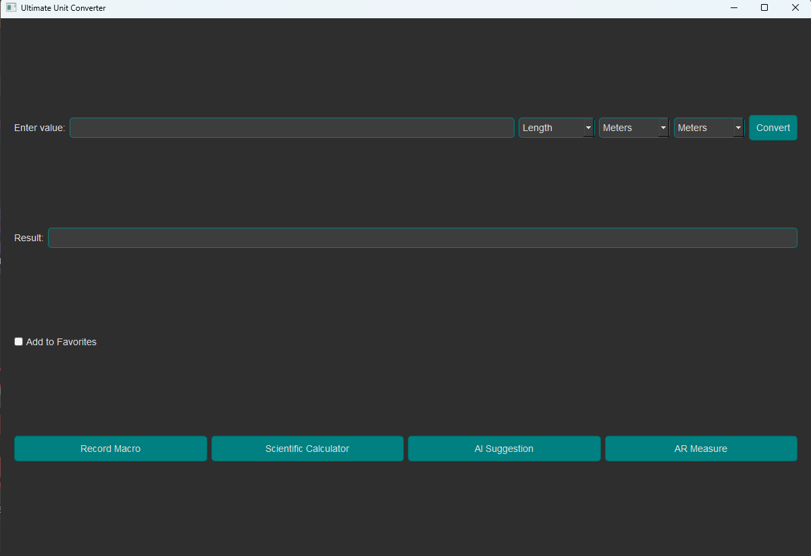

# Ultimate Unit Converter

The **Ultimate Unit Converter** is a comprehensive, multi-functional desktop application built using Python and PyQt5. It provides various unit conversion tools, advanced features like AI-based suggestions, scientific calculator integration, AR measurement capabilities, and macro recording for automated tasks. This application combines a user-friendly interface with robust functionality to enhance productivity and ease of use.

## Features

1. **Unit Conversion**
   - Convert values between various units, such as Length, Temperature, Weight, Time, Speed, Data Storage, Area, Volume, Energy, and Currency.
   - Define custom units for personalized conversion needs.

2. **Advanced Functionalities**
   - **AI Suggestion**: Get AI-based suggestions for conversions using integrated NLP and deep learning models.
   - **Macro Recording**: Automate repetitive tasks by recording macros and playing them back as needed.
   - **Scientific Calculator**: Access a built-in scientific calculator for complex mathematical computations.
   - **AR Measurement**: Utilize Augmented Reality to measure real-world objects using your device's camera.

3. **Favorites and History**
   - Save frequently used conversions to favorites.
   - View your conversion history for quick access to past conversions.

4. **Customizable Themes**
   - Dark & teal-themed user interface with easy customization options.

## Installation

1. Clone the repository:

   ```bash
   git clone https://github.com/yourusername/ultimate-unit-converter.git
   cd ultimate-unit-converter
```

2. Install the required dependencies:
```bash
pip install -r requirements.txt

```

3.Run the application:
```bash
python main.py
```

## Dependencies
- Python 3.x
- PyQt5
- NumPy
- Matplotlib
- TensorFlow

# Usage
- Launch the application.
- Select the type of conversion from the dropdown menu.
- Enter the value to convert and choose the units.
- Click the Convert button to see the result.
- Use the Favorites feature to save conversions you use frequently.
- Access advanced functionalities like AI suggestions, macro recording,  scientific calculator, and AR measurement through their respective buttons.
Screenshot:

Check releases

# Contributing
Contributions are welcome! Please fork the repository and submit a pull request for any feature enhancements or bug fixes.

# License
This project is licensed under the MIT License. See the LICENSE file for more details.
